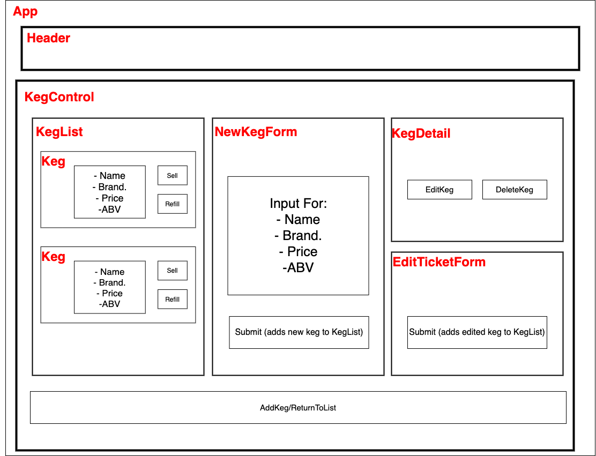

# Tap Room

### An app for a tap room in React where a bar can track their kegs.
### April 24, 2020
#### By: Brandan Sayarath

## Component Tree


## User Stories
* As a user, I want to see a list/menu of all available kegs. For each keg, I want to see its name, brand, price and alcoholContent (or perhaps something like flavor for a kombucha store).
* As a user, I want to submit a form to add a new keg to a list.
* As a user, I want to be able to click on a keg to see its detail page.
* As a user, I want to see how many pints are left in a keg. Hint: A full keg has roughly 124 pints.
* As a user, I want to be able to click a button next to a keg whenever I sell a pint of it. This should decrease the number of pints left by 1. Pints should not be able to go below 0.

## Setup/Installation Requirements

#### Node install

##### For macOS:
If Homebrew is not installed on your computer already, then install Homebrew by entering the following two commands in Terminal:
* ```$ /usr/bin/ruby -e "$(curl -fsSL https://raw.githubusercontent.com/Homebrew/install/master/install)"```
* ```$ echo 'export PATH=/usr/local/bin:$PATH' >> ~/.bashprofile```

Install Git with the following command:
* ```$ brew install git```

Next, install Node.js by entering the following command in Terminal:
* ```$ brew install node```

##### For Windows:
Please visit the [Node.js website](https://nodejs.org/en/download/) for installation instructions.

#### Install this application

Clone this repository via Terminal using the following commands:
* ```$ cd desktop```
* ```$ git clone {url to this repository}```
* ```$ cd merch-site```

Then, confirm that you have navigated to the merch-site project directory by entering "pwd" in Terminal.

Next, install npm at the project's root directory via the following commands:
* ```$ npm install```
* ```$ npm run build```

Open the contents of the directory in a text editor or IDE of your choice (e.g., to open the contents of the directory in Visual Studio Code on macOS, enter the command "code ." in Terminal).

## Technologies Used

* Git
* JavaScript
* npm
* Webpack
* React

### License

[MIT](https://choosealicense.com/licenses/mit/)

Copyright (c) 2020 **Brandan Sayarath** 